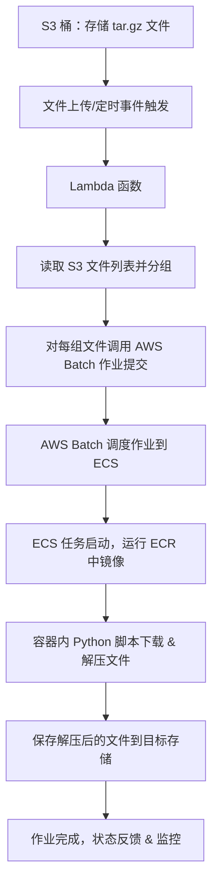

下面给出一个基于 AWS 服务（S3、Lambda、AWS Batch、ECS 和 ECR）的设计流程示例，帮助实现对 S3 中多个 tar.gz 文件的批量解压，每个容器最多处理两个文件。

---

### 整体流程说明

1. **S3 存储 tar.gz 文件**  
   在 S3 桶中存放待处理的 tar.gz 文件。当文件上传或者定期检查时，可以触发后续的处理流程。

2. **Lambda 函数触发与文件分组**  
   - **触发方式**：可以使用 S3 事件（文件上传触发）或定时任务（例如 CloudWatch Events 定时触发）调用 Lambda 函数。  
   - **文件分组**：Lambda 读取 S3 桶中待处理的 tar.gz 文件列表，根据文件总数按“每组最多 2 个文件”进行分组。例如：  
     - 如果 S3 中有 4 个文件，则分为 2 组（组1包含文件1、2；组2包含文件3、4）。  
     - 如果有 7 个文件，则分为 4 组（组1包含文件1、2；组2包含文件3、4；组3包含文件5、6；组4只包含文件7）。

3. **提交 AWS Batch 作业**  
   对于每一组文件，Lambda 分别调用 AWS Batch 的作业提交 API，传递以下参数：  
   - 使用的容器镜像（在 ECR 中已预构建的包含解压 tar.gz 的 Python 脚本的镜像）  
   - 传递该组文件的 S3 路径列表（作为作业的输入参数）  
   - 作业所需的运行资源配置

4. **AWS Batch 与 ECS 调度**  
   AWS Batch 根据提交的作业和预设的计算环境（可能是基于 EC2 或 Fargate 的 ECS 集群），将每个作业调度为一个 ECS 任务运行。  
   - 每个任务启动后，会从传入的参数中得知自己需要处理的文件列表。

5. **容器内的处理逻辑**  
   在 ECS 任务中运行的容器（即 ECR 中的镜像）启动后，内部的 Python 脚本：  
   - 根据接收到的 S3 文件路径参数，依次从 S3 下载相应的 tar.gz 文件  
   - 对每个文件执行解压操作  
   - 将解压后的内容保存到预定的目标位置（例如另一个 S3 桶或同一桶的其他目录）

6. **作业结束与状态反馈**  
   每个 AWS Batch 作业完成后，返回成功或失败状态。可以通过 CloudWatch 日志和指标对整个流程进行监控，同时记录每个文件的处理状态，避免重复处理。

7. **后续处理（可选）**  
   - 可以设置通知（例如 SNS）来告知处理完成或失败的信息。  
   - 结合 AWS Step Functions 进行更复杂的流程编排和错误重试机制。

---

### 流程图示意

---

### 注意事项

- **错误处理与重试**：Lambda 和 AWS Batch 作业中均应加入错误捕获和重试机制，确保部分失败不会导致整个流程中断。
- **权限配置**：确保 Lambda、AWS Batch 及 ECS 任务具有相应的 IAM 权限，以访问 S3、ECR 等服务。
- **扩展性**：通过分组控制每个容器处理的文件数量，既能保证并发处理能力，也能防止单个容器负载过高。
- **监控与日志**：利用 CloudWatch 日志监控 Lambda 和 ECS 的执行情况，及时响应异常情况。

通过以上设计流程，可以实现自动化触发并分批处理 S3 中的 tar.gz 文件，每个容器按照最多处理两个文件的逻辑进行解压，从而提高系统的扩展性和容错能力。
